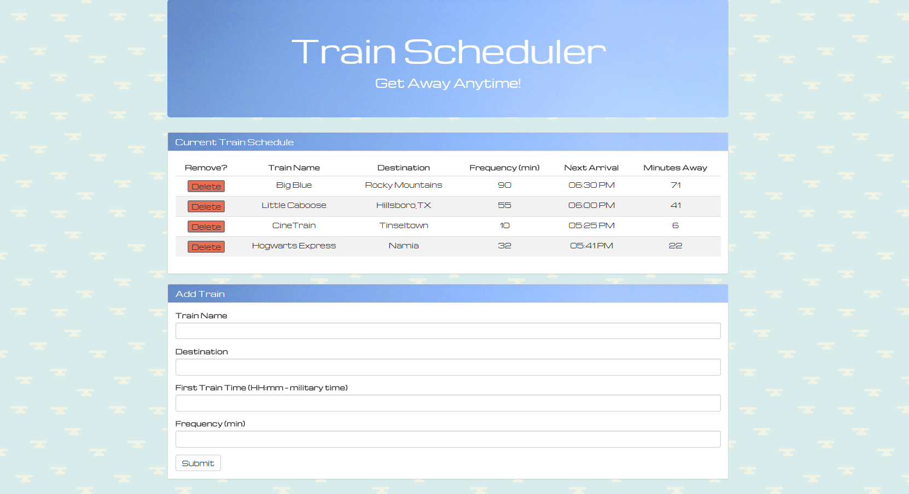

# TrainScheduler
Created a Train Scheduler using Firebase and JavaScript. This application takes the values entered into the form by the user and stores them into Firebase. Firebase persists the data added it. Moment.js is used to format the time data displayed on the scheduler.

**Technology used:** Firebase, Moment.js, Bootstrap, jQuery, JavaScript, HTML, and CSS.

Below is a screenshot of the application:
